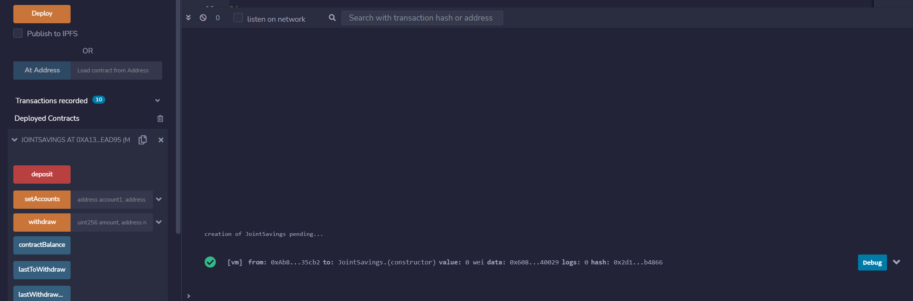
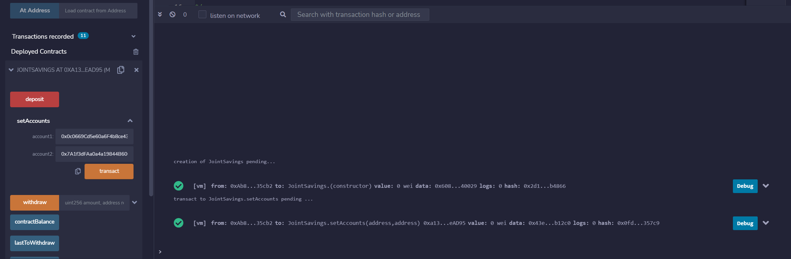
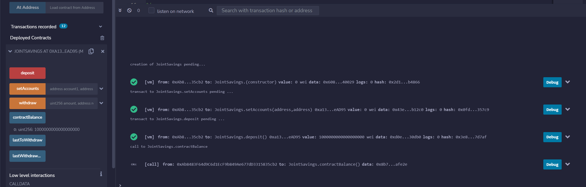
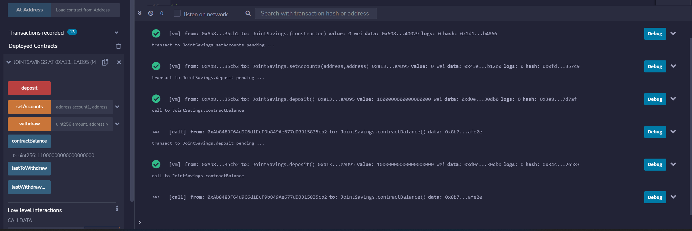
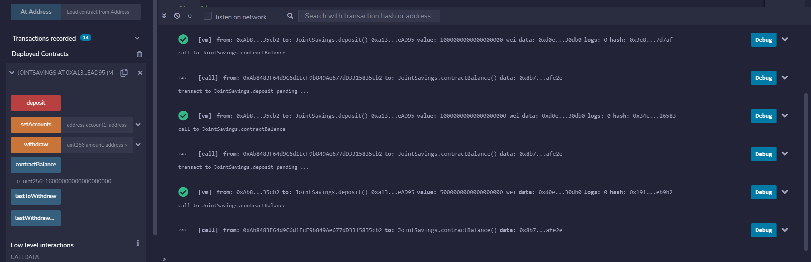
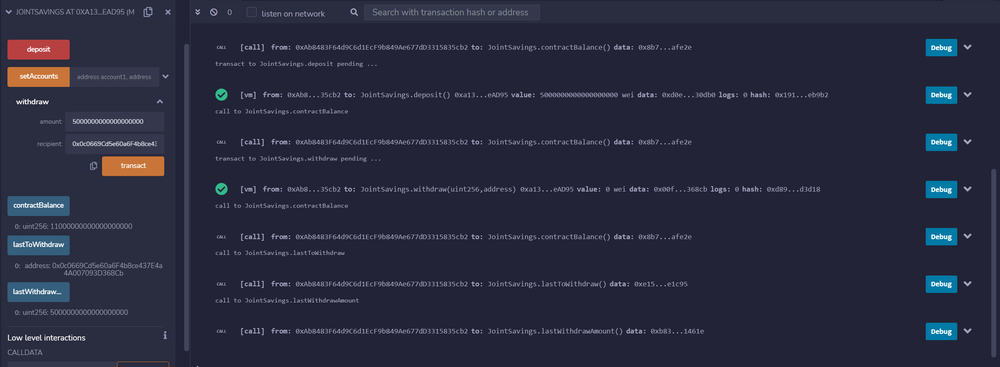
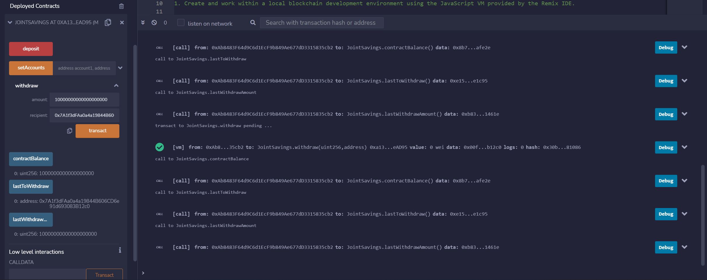

# Unit 20 - "Joint Savings Account"

### Background

A fintech startup company has recently hired you. This company is disrupting the finance industry with its own cross-border, Ethereum-compatible blockchain that connects financial institutions. Currently, the team is building smart contracts to automate many of the institutions’ financial processes and features, such as hosting joint savings accounts.

To automate the creation of joint savings accounts, you’ll create a Solidity smart contract that accepts two user addresses. These addresses will be able to control a joint savings account. Your smart contract will use ether management functions to implement a financial institution’s requirements for providing the features of the joint savings account. These features will consist of the ability to deposit and withdraw funds from the account.

### What You're Creating

* The completed Solidity `JointSavings` smart contract.

* A folder named `Execution_Results` that contains at least eight images. These images should confirm that the deposit and withdrawal transactions, which are designed to test the `JointSavings` functionality in the JavaScript VM, worked as expected.

### Instructions

1. Go to RemixIDE and create a new file.
2. Name the file something.sol.
3. Go to join_savings.sol and copy paste the code.
4. Then Compile and Depoly.
5. Then play around with deposits, withrda, account setting etc. 

---
### Results 
1. ### The Deploy

2. ### Set Accounts 1 and 2 

3. ### Deposit 1 Ether as Wei

4. ### Deposit 10 Ether as Wei 

5. ### Deposit 5 Ether 

6. ### Withdraw 5 Ether into AccountOne

7. ### Withdraw 10 Ether into AccountTwo

--- 

### Demonstration Video 

### Submission

* Upload the files for this assignment to your GitHub repository.

* Submit the link to your GitHub repo on Bootcamp Spot.

---

